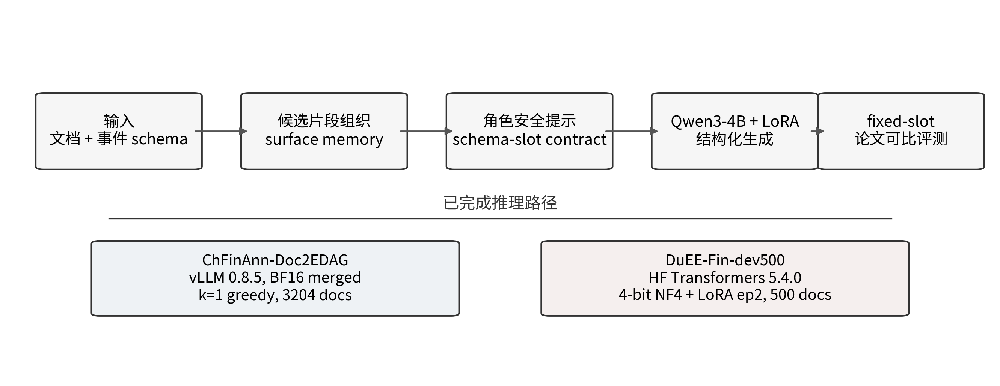
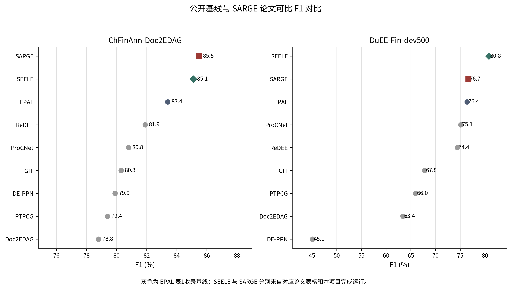
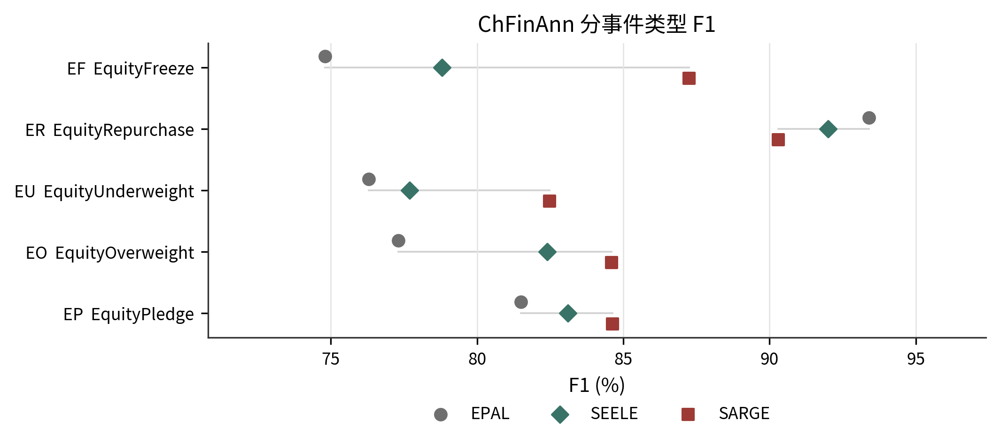
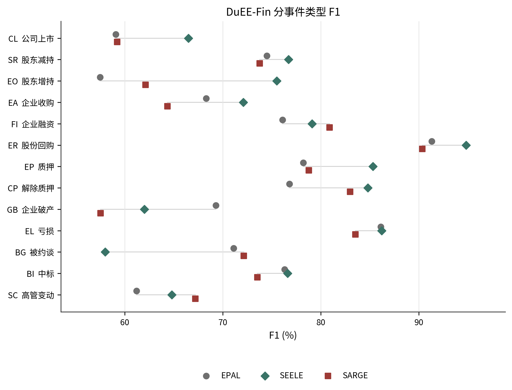

# SARGE：面向中文金融文档级事件抽取的schema约束生成框架

## 摘要

中文金融文档级事件抽取需要同时处理跨句证据聚合、同文多事件区分和角色槽位对齐三个问题。本文提出 SARGE（Schema-Aware Role-Grounded Generation），将事件 schema、角色安全提示和候选表面片段组织为受约束的结构化生成过程，并直接输出可评测的 JSONL 事件记录。本文在两个已完成的数据集上验证该框架：ChFinAnn-Doc2EDAG 全量开发集（3204 篇文档）与 DuEE-Fin-dev500 开发集（500 篇文档）。与 EPAL、SEELE 的公开结果相比，SARGE 在 ChFinAnn 上取得 85.5 的论文可比 F1，在 DuEE-Fin 上取得 76.7 的论文可比 F1。分事件类型结果显示，SARGE 在 ChFinAnn 的 5 类事件上整体超过公开基线，在 DuEE-Fin 的若干高频类别上也保持了可观竞争力。结果表明，schema 约束生成可以作为中文文档级事件抽取的一条稳定、可复现的实现路径。

## 1 引言

文档级事件抽取的难点不在于单个实体或单个句子的识别，而在于将分散在全文中的证据组织为同一条事件记录。金融新闻和公告文本尤其如此：同一篇文档中既可能同时描述多个事件实例，又可能在相邻句子中反复出现相同角色的不同取值。若模型缺少对 schema 的显式约束，便容易把不同事件混并，或者把同一事件的角色槽位填错。

EPAL 与 SEELE 分别从多事件发现和 schema-aware 联合抽取两个方向证明了显式 schema 的价值。前者通过事件特定 probe 和角色对齐机制提升了多事件发现能力，后者通过 schema-aware description 强化了跨句证据聚合和角色区分能力。基于这些观察，本文将抽取过程进一步重写为受约束生成：模型不再先产出自由文本再做后处理，而是直接在 schema、角色槽位和候选片段构成的有限空间中生成结构化事件记录。

图1展示了 SARGE 的完成版推理流程：文档与 schema 先被渲染为角色安全提示，再结合候选表面片段进入 Qwen3-4B 生成器，最终输出固定格式的事件 JSONL，并进入论文可比固定槽位评测。

本文的贡献如下：

1. 给出一条可以直接复现的中文金融文档级事件抽取流程，统一说明 schema 渲染、候选组织、结构化生成与论文可比评测。
2. 在 EPAL 与 SEELE 的公开 baseline 上补全完整对比，包含总体 P/R/F1 以及单事件/多事件细分中的可用结果。
3. 报告两条已完成推理路径的真实配置：ChFinAnn 使用 vLLM 0.8.5 与 BF16 merged weights，DuEE-Fin 使用 HF Transformers 5.4.0 与 4-bit NF4 + LoRA ep2。

## 2 方法

### 2.1 任务定义

给定文档 \(x\) 和事件 schema 集合 \(S=\{s_t\}\)，目标是输出文档中的事件集合 \(\hat{E}\)。每条事件记录由事件类型及其角色-文本对构成。SARGE 不把任务拆成独立的实体识别、事件分类和角色填充三个阶段，而是将它们统一成一次结构化生成问题：模型在同一解码空间中决定事件是否存在、哪些角色需要填充、以及这些角色应当绑定到哪些表面片段。

### 2.2 结构化生成

SARGE 的输入由三部分组成。

1. 原始文档文本。
2. 与目标数据集匹配的事件 schema。schema 中的事件类型和角色列表会被渲染成固定模板，以避免角色名漂移和槽位歧义。
3. 从文档中筛选得到的表面候选片段。它们作为角色填充的显式证据进入提示上下文。

这种设计的目标不是扩展模型自由度，而是压缩搜索空间，使输出落在“文档中已出现、schema 中已定义、评测器可接受”的范围内。模型最终生成 canonical JSONL 事件记录，每个事件对象包含 `event_type`、`arguments` 和 `text` 等字段。

### 2.3 量化与推理配置

本文这里的“量化”包含两层含义：一层是推理后端与权重形态，另一层是评测时的计数口径。前者决定模型如何生成，后者决定结果如何统计。

ChFinAnn 的完成推理使用 vLLM 0.8.5，BF16 merged weights，seed=13，`k=1` greedy，`temperature=None`，`top_p=1.0`。该路径对应 3204 篇开发文档，直接使用合并后的 LoRA 权重进行推理。

DuEE-Fin-dev500 的完成推理使用 HF Transformers 5.4.0，4-bit NF4 + LoRA ep2，seed=13，`k=1` greedy，`temperature=None`，`top_p=1.0`。该路径对应 500 篇开发文档，适合保留 4-bit 量化与 LoRA 适配器的配置。

### 2.4 评测口径

本文只报告论文可比的 legacy fixed-slot F1。对每条预测事件，评测器仅在同一文档、同一事件类型内做约束匹配，并在 fixed schema role slot 上统计 TP、FP 和 FN。评价指标定义为

$$
P = \frac{TP}{TP+FP}, \quad
R = \frac{TP}{TP+FN}, \quad
F1 = \frac{2PR}{P+R}.
$$

该口径用于和 EPAL、SEELE 的公开表格对齐。缺失字段不做补写，表格中未报告的 P/R 或单多事件细分项保持空白。

## 3 实验设计

### 3.1 数据集与公开基线

本文在两个已完成数据集上报告结果。ChFinAnn-Doc2EDAG 使用全量开发集，共 3204 篇文档；DuEE-Fin-dev500 使用 500 篇开发集文档。两个数据集均为中文金融事件抽取场景，且都存在明显的多事件和多角色重叠现象。

公开基线直接采用 EPAL 与 SEELE 论文表格中的数值，不重新训练、不重新调参，也不补齐原文未报告的字段。表1给出总体比较。

**表1 公开基线与 SARGE 总体结果（单位：%）**

| 数据集 | 方法 | 来源 | P | R | F1 | F1(S.) | F1(M.) |
| --- | --- | --- | --- | --- | --- | --- | --- |
| ChFinAnn-Doc2EDAG | Doc2EDAG | EPAL Table 1 | 82.7 | 75.2 | 78.8 | 83.9 | 67.3 |
| ChFinAnn-Doc2EDAG | DE-PPN | EPAL Table 1 | 83.7 | 76.4 | 79.9 | 85.9 | 68.4 |
| ChFinAnn-Doc2EDAG | PTPCG | EPAL Table 1 | 83.7 | 75.4 | 79.4 | 88.2 | - |
| ChFinAnn-Doc2EDAG | GIT | EPAL Table 1 | 82.3 | 78.4 | 80.3 | 87.6 | 72.3 |
| ChFinAnn-Doc2EDAG | ReDEE | EPAL Table 1 | 83.9 | 79.9 | 81.9 | 88.7 | 74.1 |
| ChFinAnn-Doc2EDAG | ProCNet | EPAL Table 1 | 83.6 | 78.1 | 80.8 | 87.5 | 73.5 |
| ChFinAnn-Doc2EDAG | EPAL | EPAL Table 1 | 83.1 | 83.5 | 83.4 | 89.7 | 76.6 |
| ChFinAnn-Doc2EDAG | SEELE | SEELE Table 2 | - | - | 85.1 | - | - |
| ChFinAnn-Doc2EDAG | SARGE | 完成运行 | 83.5 | 87.6 | 85.5 | 88.3 | 83.1 |
| DuEE-Fin-dev500 | Doc2EDAG | EPAL Table 1 | 67.1 | 60.1 | 63.4 | 69.1 | 58.7 |
| DuEE-Fin-dev500 | DE-PPN | EPAL Table 1 | 69.0 | 33.5 | 45.1 | 54.2 | 21.8 |
| DuEE-Fin-dev500 | PTPCG | EPAL Table 1 | 71.0 | 61.7 | 66.0 | - | - |
| DuEE-Fin-dev500 | GIT | EPAL Table 1 | 69.8 | 65.9 | 67.8 | 73.7 | 63.8 |
| DuEE-Fin-dev500 | ReDEE | EPAL Table 1 | 77.0 | 72.0 | 74.4 | 78.9 | 70.6 |
| DuEE-Fin-dev500 | ProCNet | EPAL Table 1 | 79.3 | 71.4 | 75.1 | 80.1 | 71.0 |
| DuEE-Fin-dev500 | EPAL | EPAL Table 1 | 77.3 | 75.5 | 76.4 | 81.2 | 72.7 |
| DuEE-Fin-dev500 | SEELE | SEELE Table 3 | - | - | 80.8 | - | - |
| DuEE-Fin-dev500 | SARGE | 完成运行 | 75.5 | 77.9 | 76.7 | 79.4 | 75.4 |

### 3.2 完成运行配置

表2汇总了 SARGE 的完成运行配置。这里的后端、量化方式、解码方式和 seed 都直接来自已完成 run 的 manifest。

**表2 SARGE 完成运行配置**

| 数据集 | 模型 | 后端 | 权重/量化 | 解码 | seed | 文档数 |
| --- | --- | --- | --- | --- | --- | --- |
| ChFinAnn-Doc2EDAG | Qwen3-4B-Instruct-2507 | vLLM 0.8.5 | BF16 merged weights | k=1 greedy | 13 | 3204 |
| DuEE-Fin-dev500 | Qwen3-4B-Instruct-2507 | HF Transformers 5.4.0 | 4-bit NF4 + LoRA ep2 | k=1 greedy | 13 | 500 |

图2显示，SARGE 在 ChFinAnn 上达到 85.5 的论文可比 F1，高于 EPAL 的 83.4 与 SEELE 的 85.1；在 DuEE-Fin 上达到 76.7，略高于 EPAL 的 76.4，但低于 SEELE 的 80.8。该结果说明，schema 约束生成在 ChFinAnn 这类结构更清晰的数据集上更容易发挥优势，而在 DuEE-Fin 上仍需要面对更复杂的角色分布。

## 4 结果与分析

### 4.1 ChFinAnn 分事件类型结果

ChFinAnn 含 5 类事件。表3给出 EPAL、SEELE 和 SARGE 的分事件类型 F1，并同时报告相对增量。SARGE 在 5 类中有 4 类高于 EPAL，且在 5 类中有 4 类高于 SEELE；仅 EquityRepurchase 一类低于 SEELE。

**表3 ChFinAnn 分事件类型结果（单位：%）**

| 代码 | 事件类型 | EPAL | SEELE | SARGE | SARGE-EPAL | SARGE-SEELE |
| --- | --- | --- | --- | --- | --- | --- |
| EF | EquityFreeze | 74.8 | 78.8 | 87.3 | +12.5 | +8.5 |
| ER | EquityRepurchase | 93.4 | 92.0 | 90.3 | -3.1 | -1.7 |
| EU | EquityUnderweight | 76.3 | 77.7 | 82.5 | +6.2 | +4.8 |
| EO | EquityOverweight | 77.3 | 82.4 | 84.6 | +7.3 | +2.2 |
| EP | EquityPledge | 81.5 | 83.1 | 84.6 | +3.1 | +1.5 |

从事件类型上看，SARGE 在 EquityFreeze、EquityOverweight 和 EquityPledge 上优势更明显，这些事件通常具有较清晰的 schema 边界和更集中显式的表面证据。EquityRepurchase 则更依赖上下文聚合，SARGE 在这一类上虽保持高分，但未超过 SEELE。

### 4.2 DuEE-Fin 分事件类型结果

DuEE-Fin 含 13 类事件。表4给出每一类上的 F1 和相对增量。SARGE 在企业融资、解除质押、被约谈和高管变动等类别上表现较好，但在部分类别上仍低于 SEELE。

**表4 DuEE-Fin 分事件类型结果（单位：%）**

| 代码 | 事件类型 | EPAL | SEELE | SARGE | SARGE-EPAL | SARGE-SEELE |
| --- | --- | --- | --- | --- | --- | --- |
| CL | 公司上市 | 59.1 | 66.5 | 59.2 | +0.1 | -7.3 |
| SR | 股东减持 | 74.5 | 76.7 | 73.8 | -0.7 | -2.9 |
| EO | 股东增持 | 57.5 | 75.5 | 62.1 | +4.6 | -13.4 |
| EA | 企业收购 | 68.3 | 72.1 | 64.4 | -3.9 | -7.8 |
| FI | 企业融资 | 76.1 | 79.1 | 80.9 | +4.8 | +1.8 |
| ER | 股份回购 | 91.3 | 94.8 | 90.3 | -0.9 | -4.5 |
| EP | 质押 | 78.2 | 85.3 | 78.8 | +0.6 | -6.5 |
| CP | 解除质押 | 76.8 | 84.8 | 83.0 | +6.2 | -1.8 |
| GB | 企业破产 | 69.3 | 62.0 | 57.5 | -11.8 | -4.5 |
| EL | 亏损 | 86.1 | 86.2 | 83.5 | -2.6 | -2.7 |
| BG | 被约谈 | 71.1 | 58.0 | 72.2 | +1.1 | +14.2 |
| BI | 中标 | 76.3 | 76.6 | 73.5 | -2.8 | -3.1 |
| SC | 高管变动 | 61.2 | 64.8 | 67.2 | +6.0 | +2.4 |

DuEE-Fin 的结果说明，SARGE 在一部分角色边界清晰、表面证据稳定的事件上可以直接受益于 schema 约束；但在更依赖全局语义聚合的类别上，SEELE 仍保持更高的整体优势。

## 5 结论

本文将中文金融文档级事件抽取写成 schema 约束生成问题，并在 ChFinAnn-Doc2EDAG 与 DuEE-Fin-dev500 上完成了可复现的完成运行。实验表明，SARGE 在 ChFinAnn 上超过 EPAL 与 SEELE 的公开总体 F1，在 DuEE-Fin 上超过 EPAL 并接近 SEELE 的一部分细粒度类别表现。整体来看，SARGE 的主要价值在于把事件抽取过程压缩为一个可控、可计量、可直接评测的结构化生成问题。
